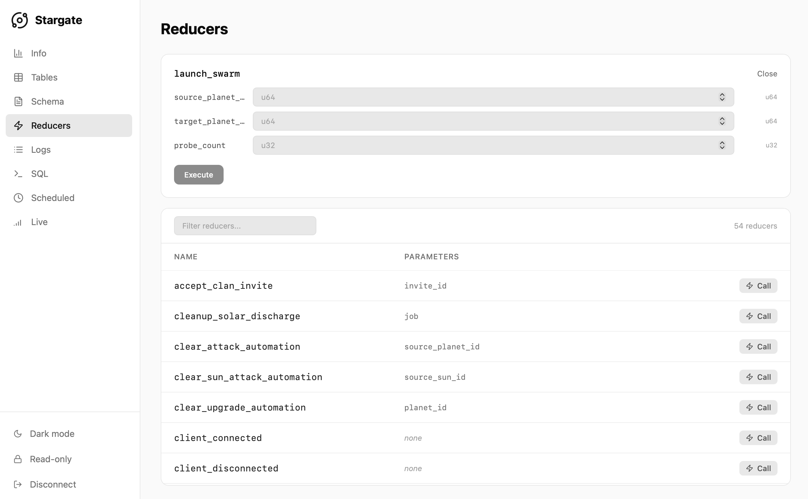

# Stargate — a desktop GUI client for SpacetimeDB

**Website: [stargate-client.com](https://stargate-client.com/) · [Download the latest release](https://github.com/fabianboesiger/stargate/releases/latest)**

Stargate is a native desktop GUI for [SpacetimeDB](https://spacetimedb.com). It connects to Maincloud
(the managed cloud) or to any instance you host yourself. From a single window you can browse tables,
read the schema, call reducers, follow logs, run SQL, watch live data over WebSocket, and check on
scheduled tasks — so you don't have to keep the `spacetime` CLI in your head.

It runs on macOS, Windows, and Linux, and speaks SpacetimeDB's HTTP and WebSocket API directly. That
means it doesn't care what language your module is written in (Rust, C#, TypeScript, C++) or which
client you ship alongside it.

[](https://github.com/fabianboesiger/stargate/releases/latest)




## Features

- **Table browser** — page through tables, filter rows, and export to CSV or JSON.
- **Schema inspector** — tables, reducers, indexes, and constraints, kept in sync with the database.
- **Reducer console** — call any reducer by name with typed arguments. Write calls need a read-write license.
- **Live logs** — tail the recent lines or follow them live, with levels highlighted.
- **SQL console** — run queries, view the results in a table, and export them.
- **Live view** — subscribe over WebSocket and watch rows change. Handy for debugging multiplayer state.
- **Scheduled tasks** — see which reducers are scheduled and when they run.
- **OpenAPI export** — generate an OpenAPI 3.1 document for the connected database.
- **Saved connections** — save servers and databases and reconnect with a click.
- **Read-only by default** — writes only happen once you turn them on, so you won't change production by accident.
- **Light and dark themes.**

## Use cases

- Watch tables and the live view update as players act, to debug multiplayer game state.
- Poke around a SpacetimeDB database without reaching for the `spacetime` CLI.
- Call a reducer by hand with typed arguments to reproduce a bug or seed some data.
- Read and follow module logs while you develop.
- Run a one-off SQL query and export the results to CSV or JSON.
- Open a production database in read-only mode when you just need to look, not touch.

## Install

Grab a build for your platform from the
[latest release](https://github.com/fabianboesiger/stargate/releases/latest):

| Platform | Asset |
| --- | --- |
| macOS (Apple Silicon) | `stargate-macos-aarch64.tar.gz` (unpack, move `Stargate.app` to Applications) |
| Windows (x86-64) | `stargate-windows-x86_64-setup.exe` (installer) |
| Linux (x86-64) | `stargate-linux-x86_64.AppImage` (mark executable, run) |

## Connect

Sign in with your SpacetimeDB CLI credentials or a token, pick a server and database, and connect:

- **Maincloud** — sign in with your existing Maincloud login.
- **Self-hosted** — enter your server's URL, whether that's `spacetime start`, a Docker container,
  or a production host you run.
- **Local** — point Stargate at `http://localhost:3000` while you develop.

Credentials and saved logins never leave your machine.

## Pricing

Reading is free, including every inspection and query feature. A per-device license (in CHF) unlocks
read-write mode for mutating reducers and write SQL. See
[stargate-client.com](https://stargate-client.com/#pricing).

## Build from source

Stargate is built with [Rust](https://www.rust-lang.org/) and [Dioxus](https://dioxuslabs.com/).

```sh
# Install the Dioxus CLI, then:
dx build --release --platform desktop --package stargate
```

## Links

- Website: https://stargate-client.com/
- Releases / download: https://github.com/fabianboesiger/stargate/releases/latest
- SpacetimeDB: https://spacetimedb.com

---

Built by [Fabian Bösiger](https://github.com/fabianboesiger). Not affiliated with SpacetimeDB or
Clockwork Labs.
